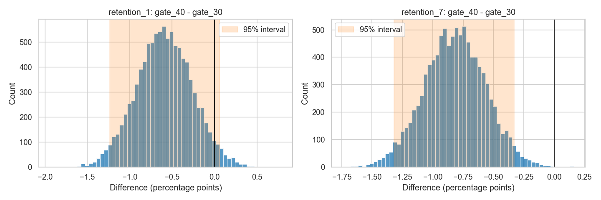
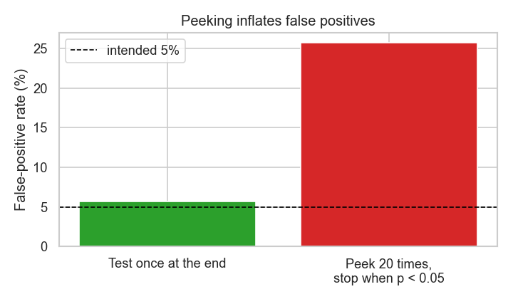

# 🎮 A/B Test Analysis: should Cookie Cats move its first gate from level 30 to 40?

A complete, decision-focused analysis of a **real online experiment with 90,189 players** — the kind of work a data scientist does before a product change ships: sanity checks, hypothesis tests, confidence intervals, bootstrap, a Bayesian view, multiple-testing correction, power analysis, the peeking pitfall, and a clear recommendation.


📓 **Full report:** [`notebooks/ab_test_analysis.ipynb`](notebooks/ab_test_analysis.ipynb)

## The question

In the mobile game **Cookie Cats**, players periodically hit a **gate** where they must wait or pay. The team randomly moved the first gate from **level 30 (A)** to **level 40 (B)** for new players. Should they keep the change?

Metrics were fixed **before** looking at results: **7-day retention (primary)**, 1-day retention (secondary), game rounds (guardrail). α = 0.05.

## Result: keep the gate at level 30

| Metric | Gate 30 | Gate 40 | Difference (95% CI) | p-value | Holm-adjusted p |
|---|---|---|---|---|---|
| **7-day retention** | 19.02% | 18.20% | **−0.82 pp** [−1.33, −0.31] | **0.0016** | **0.005** ✅ |
| 1-day retention | 44.82% | 44.23% | −0.59 pp [−1.24, +0.06] | 0.074 | 0.10 |
| Game rounds (median) | 17 | 16 | −1 [−1, 0] (bootstrap) | 0.050 (Mann-Whitney) | 0.10 |

- Moving the gate to 40 **lowers 7-day retention by 4.3% (relative)** — about **820 fewer players still active after a week per 100,000 installs**.
- The **Bayesian** analysis gives a **99.9% probability** that level 30 retains better; choosing level 40 carries an expected loss of 0.82 pp versus ~0 for level 30.
- The **bootstrap** (10,000 resamples) agrees with the z-test.
- 1-day retention and engagement do not improve with level 40 (both lean slightly worse), so nothing offsets the loss.



## What makes the analysis trustworthy

| Check | Finding |
|---|---|
| **Sample ratio mismatch** | 44,700 vs 45,489 players (49.6 / 50.4%). χ² p = 0.009 — below 0.05 but above the **0.001 alert threshold** used for SRM, so the analysis proceeds, with the imbalance noted as a limitation |
| **Outliers** | one player logged **49,854 rounds** in two weeks (next highest 2,961) — a bot or logging error; engagement is analysed with **medians and rank-based tests**, which it cannot distort |
| **Multiple testing** | three metrics → **Holm correction**; the primary result survives |
| **Power** | with ~44,700 players per group the minimum detectable 7-day effect is **0.74 pp**; the observed 0.82 pp is above it. (Reported as MDE, not "observed power", which merely restates the p-value) |

## The peeking problem, demonstrated

Simulating 2,000 **A/A tests** (no true difference): testing once at the planned end gives a **5.7%** false-positive rate, as intended; checking 20 times and stopping at the first p < 0.05 gives **25.7%** — a false "winner" in one test out of four.



## Run it

```bash
pip install -r requirements.txt
kaggle datasets download -d yufengsui/mobile-games-ab-testing -p data --unzip
python build_notebook.py      # rebuilds and executes notebooks/ab_test_analysis.ipynb, writes reports/
python -m pytest -q           # checks the statistics against statsmodels and textbook values
```

## Project structure

```text
├── ab/stats.py                   # SRM test, two-proportion z-test, bootstrap, Bayesian A/B,
│                                 # power & sample size, peeking simulation
├── build_notebook.py             # builds + executes the report notebook
├── notebooks/ab_test_analysis.ipynb
├── reports/                      # charts + results.json
└── tests/test_stats.py
```

## Tech stack

Python · pandas · NumPy · SciPy · statsmodels · Matplotlib · Seaborn · Jupyter · pytest

*Data: [Mobile Games A/B Testing — Cookie Cats](https://www.kaggle.com/datasets/yufengsui/mobile-games-ab-testing) (Kaggle).*
